# Context Map

- `context/summary.md`
- `context/terminology.md`
- `context/practices.md`
- `context/tooling/monorepo-commands.md`
- `context/tooling/local-dev.md`
- `context/tooling/docker-images.md`
- `context/tooling/migrations.md`
- `context/tooling/scripts.md`
- `context/observability/package.md`
- `context/plans/github-app-auth.md`
- `context/plans/otel-observability.md`
- `context/plans/parallel-pagination-option.md`
- `context/temporal/baseline-design.md`
- `context/temporal/railway-images.md`
- `context/temporal/extract-worker.md`
- `context/temporal/transform-worker.md`
- `context/temporal/orchestrator.md`
- `context/temporal/basic-auth-proxy.md`

## Invariants
- Every context file covers one topic and stays under 250 lines.

## Contracts
- All new context files must be added to this map.

## Rationale
- A single index keeps discovery consistent across sessions.

## Lessons
- Update the map before adding new domain folders.

## Code Example
```ts
export const contextIndex = [
  "context/summary.md",
  "context/terminology.md",
  "context/practices.md",
  "context/tooling/monorepo-commands.md",
  "context/tooling/local-dev.md",
  "context/tooling/docker-images.md",
  "context/tooling/migrations.md",
  "context/tooling/scripts.md",
  "context/observability/package.md",
  "context/plans/github-app-auth.md",
  "context/plans/otel-observability.md",
  "context/plans/parallel-pagination-option.md",
  "context/temporal/baseline-design.md",
  "context/temporal/railway-images.md",
  "context/temporal/extract-worker.md",
  "context/temporal/transform-worker.md",
  "context/temporal/orchestrator.md",
  "context/temporal/basic-auth-proxy.md",
];
```

## Diagram

```mermaid
flowchart TD
  context[context/] --> core[core files]
  context --> observability[observability/]
  context --> plans[plans/]
  context --> temporal[temporal/]
  context --> tooling[tooling/]
  observability --> obsPackage[package.md]
  core --> summary[summary.md]
  core --> terminology[terminology.md]
  core --> practices[practices.md]
  plans --> githubAuth[github-app-auth.md]
  plans --> otel[otel-observability.md]
  plans --> parallelPagination[parallel-pagination-option.md]
  tooling --> commands[monorepo-commands.md]
  tooling --> localDev[local-dev.md]
  tooling --> migrations[migrations.md]
  tooling --> scripts[scripts.md]
  temporal --> baseline[baseline-design.md]
  temporal --> railwayImages[railway-images.md]
  temporal --> extractWorker[extract-worker.md]
  temporal --> transformWorker[transform-worker.md]
  temporal --> orchestrator[orchestrator.md]
  temporal --> basicAuthProxy[basic-auth-proxy.md]
```


## Related

- [Summary](summary.md)
- [Monorepo commands](tooling/monorepo-commands.md)
- [Tooling scripts](tooling/scripts.md)
- [Temporal baseline design](temporal/baseline-design.md)
- [Extract worker](temporal/extract-worker.md)
- [Transform worker](temporal/transform-worker.md)
- [Orchestrator](temporal/orchestrator.md)
- [Basic auth proxy](temporal/basic-auth-proxy.md)
