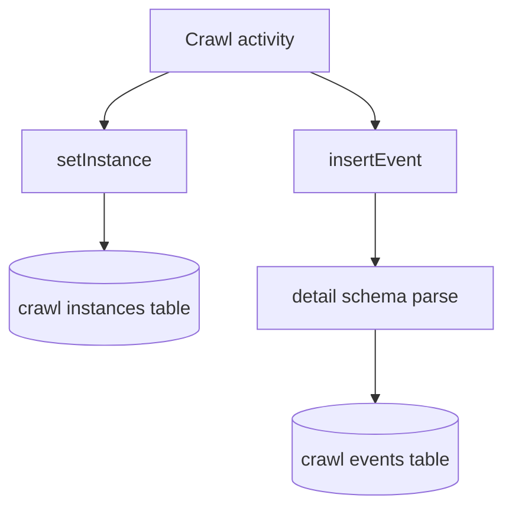

# Crawl Functions

`@dxta/crawl-functions` defines typed crawl helpers around crawl DB entities and
event insertion.

## Invariants
- Public exports are `config`, `setInstance`, and `insertEvent` from
  `packages/functions/crawl/src/index.ts`.
- Function signature is standardized through `CrawlFunction<I, O, E>` with
  `{ db, entities }` context.
- Event payloads are validated by detail type (`crawlInfo`, `crawlFailed`,
  `crawlComplete`) before insert.

## Contracts
- `setInstance` writes a crawl instance row and returns `{ instanceId }`.
- `insertEvent` writes crawl event rows with conflict-safe insert and returns
  `{ eventId }`.
- Callers must provide the matching `entities` table subset in context.

## Rationale
- The package keeps crawl writes small, typed, and idempotent for retry-safe
  activity execution.

## Lessons
- Input/output and required entities are encoded at the type level, reducing
  runtime wiring mistakes.

## Code Example
```ts
export type CrawlFunction<I extends Input, O, E extends Partial<Entities>> = (
  input: I,
  context: Context<E>,
) => Promise<O>;
```

## Diagram


## Related
- [Functions domain](packages-functions.md)
- [Patterns](../patterns.md)
