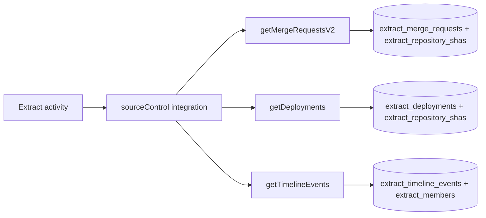

# Extract Functions

`@dxta/extract-functions` is the main extraction function package for
source-control data fetch + upsert into extract schema tables.

## Invariants
- Public API is exported from `packages/functions/extract/src/index.ts` and
  includes commits, deployments, members, MR diffs/notes/timeline, repository,
  and workflow-deployment helpers.
- Shared function type is `ExtractFunction<I, O, SC, E>` with context
  `{ integrations, db, entities }`.
- Functions that call provider APIs validate `integrations.sourceControl`
  presence and throw explicit errors when missing.

## Contracts
- `getMergeRequestsV2` fetches paginated MRs, applies optional watermark
  filtering, upserts `repositoryShas` + `mergeRequests`, and returns both raw
  and processable MR sets.
- `getDeployments` fetches paginated deployments, upserts SHAs and deployments,
  and returns persisted rows with pagination metadata.
- `getTimelineEvents` validates namespace/repository/MR IDs, fetches timeline,
  upserts timeline events and members, and links repository-member relations.

## Rationale
- This package centralizes extraction behavior so worker activities stay thin and
  orchestration logic stays in workflows.

## Lessons
- Upserts consistently touch `_updatedAt` to keep idempotent retries visible as
  refreshes without duplicate rows.
- `getMergeRequestsV2` uses `isRelativeResidualMergeRequest(...)` to avoid
  processing stale residual merge requests when watermark mode is enabled.

## Code Example
```ts
export type ExtractFunction<I extends Input, O, SC, E> = (
  input: I,
  context: Context<SC, E>,
) => Promise<O>;
```

## Diagram


## Related
- [Functions domain](packages-functions.md)
- [Source control integration notes](../tooling/scripts.md)
- [Extract worker](../temporal/extract-worker.md)
