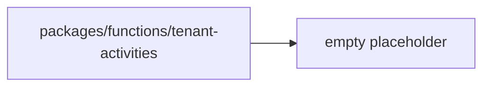

# Tenant Activities Placeholder

`packages/functions/tenant-activities/` exists but is currently empty.

## Invariants
- No source files, exports, or package manifest exist in this folder today.

## Contracts
- No runtime or build-time behavior is currently defined for this path.

## Rationale
- The folder name suggests planned tenant-scoped function/activity helpers, but
  no implementation has landed yet.

## Lessons
- If this folder becomes active, add a package manifest, explicit exports, and a
  matching context file update in the same change.

## Code Example
```ts
// Placeholder: no code in packages/functions/tenant-activities yet.
```

## Diagram


## Related
- [Functions domain](packages-functions.md)
