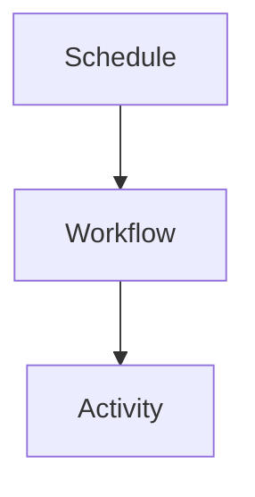

# Glossary

Temporal - workflow engine used for orchestration on Railway.
Workflow - deterministic orchestration code in `apps/workflows`.
Activity - I/O function executed by workers.
Worker - Temporal service hosting activities and polling a task queue.
Task queue - named queue workers poll (`extract` or `transform`).
Schedule - Temporal schedule that starts workflows on a cadence.
Child workflow - workflow started by another workflow for sub-orchestration.
extractTenantsWorkflow - main extract entry point workflow.
extractRepositoryWorkflow - per-repo extract orchestration.
extractMergeRequestWorkflow - per-MR extract orchestration.
transformTenantsWorkflow - main transform entry point workflow (fetches tenants, fans out to repos).
transformRepositoryWorkflow - per-repo transform orchestration (queries MR-deployment pairs, transforms each).
Railway - hosting platform for Temporal server and workers.
Orchestrator - app for manual triggers and schedule management (`apps/orchestrator`).

## Invariants
- Glossary entries reflect current architecture direction and workflow names.

## Contracts
- Workflow and activity names align with exported functions.

## Rationale
- Shared vocabulary ensures consistent communication about the architecture.

## Lessons
- "Workflow" means orchestration only; "activity" means I/O.

## Code Example
```ts
export type RunMode = "full" | "incremental";
```

## Diagram


## Related
- [Overview](overview.md)
- [Temporal migration plan](plans/temporal-migration.md)
- [Baseline design](temporal/baseline-design.md)
