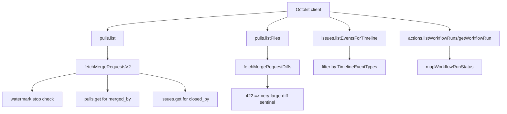

# GitHub Source Control

`GitHubSourceControl` (`packages/integrations/source-control/src/github/index.ts`)
implements the `SourceControl` contract using Octokit and normalizes GitHub API
responses into `@dxta/extract-schema` records.

## Invariants
- Merge request extraction for GitHub uses `fetchMergeRequestsV2(...)` with
  `pulls.list` sorted by `updated desc`; legacy `fetchMergeRequests(...)` is not
  implemented in this class.
- Timeline extraction only keeps allowed event types from
  `TimelineEventTypes` and discards unsupported events.
- Workflow-run and deployment statuses are mapped into extract deployment status
  enum values through `mapWorkflowRunStatus(...)` and
  `mapWorkflowRunConclusion(...)`.

## Contracts
- `fetchMergeRequestsV2(...)` returns page metadata as
  `{ page, perPage, hasMore }` and sets `reachedWatermark` when the oldest PR in
  the page is older than `updatedAfter`.
- `fetchMergeRequestMerger(...)` and `fetchMergeRequestCloser(...)` are separate
  follow-up calls because `pulls.list` does not include `merged_by`/`closed_by`.
- `fetchMergeRequestDiffs(...)` catches GitHub 422 large-diff responses and
  returns one deterministic placeholder diff with
  `newPath/oldPath = urn:dxta-pipeline:very-large-diff`.

## Rationale
- The implementation favors predictable extraction outputs over strict API
  fidelity so retries and pagination remain deterministic inside Temporal
  activities.

## Lessons
- Collaborator fetching can fail for tokens without push access; method
  suppresses this one GitHub error and returns an empty member page.
- Deployment status resolution prefers ordered status events (first success,
  first failure/error, inactive, pending) instead of trusting the last event
  alone.

## Code Example
```ts
const oldestPr = mergeRequests[mergeRequests.length - 1];
const reachedWatermark =
  updatedAfter !== undefined &&
  oldestPr !== undefined &&
  oldestPr.updatedAt !== undefined &&
  oldestPr.updatedAt < updatedAfter;

return {
  mergeRequests,
  pagination: {
    page,
    perPage,
    hasMore: hasNextPage && !reachedWatermark,
  },
  reachedWatermark,
};
```

## Diagram


## Related
- [Source control integration](source-control.md)
- [Extract functions](../functions/extract-functions.md)
- [Temporal extract worker](../temporal/extract-worker.md)
