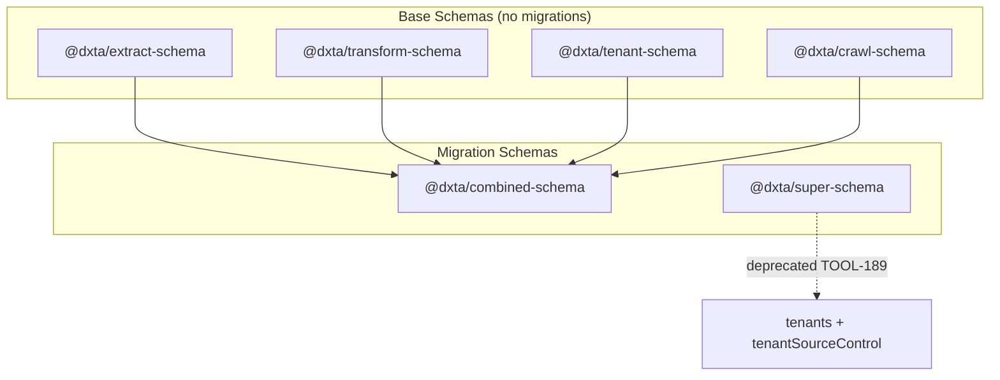

# Database Migrations

Drizzle Kit generates SQL migrations for the schema packages. The project has
two migration targets: **combined** (per-tenant databases) and **super**
(central tenant registry).

## Schema Architecture



## Packages

| Package | Purpose | Migrations Output |
|---------|---------|-------------------|
| `@dxta/combined-schema` | All per-tenant tables (extract + transform + tenant + crawl) | `migrations/combined/` |
| `@dxta/super-schema` | Central tenant registry (deprecated) | `migrations/super/` |

Base schemas (`extract`, `transform`, `tenant`, `crawl`) define tables but do
not generate migrations directly—they are aggregated by `combined-schema`.

## Commands

Generate migrations for a specific schema:

```bash
# Combined (primary - used for tenant databases)
pnpm --filter @dxta/combined-schema db:generate

# Super (deprecated - central tenant registry)
pnpm --filter @dxta/super-schema db:generate
```

Generate all migrations at once:

```bash
pnpm run db:generate
```

## How It Works

1. Each migration schema has a `drizzle.config.ts` pointing to its index:
   ```ts
   export default defineConfig({
     schema: "./src/index.ts",
     out: "../../../migrations/combined",
     dialect: "sqlite",
   });
   ```

2. `drizzle-kit generate` compares the current schema against snapshots in
   `migrations/{combined,super}/meta/` and creates new SQL files if changed.

3. Migration files are named with sequence numbers:
   - `0000_smooth_enchantress.sql`
   - `0001_abandoned_ronan.sql`

## Upgrading Snapshot Format

If you see "snapshot.json is not of the latest version", run `drizzle-kit up`:

```bash
pnpm --filter @dxta/combined-schema exec drizzle-kit up
pnpm --filter @dxta/super-schema exec drizzle-kit up
```

This upgrades the snapshot metadata format without changing the SQL migrations.

## Usage in Tests

Tests use the combined migrations folder:

```ts
import { migrate } from "drizzle-orm/better-sqlite3/migrator";

await migrate(db, { migrationsFolder: "../../../migrations/combined" });
```

## Invariants

- Only `combined-schema` and `super-schema` generate migrations.
- Base schemas are composed into `combined-schema` via re-exports.
- `super-schema` is deprecated; prefer `combined-schema` for new work.

## Contracts

- Migration output paths are relative to the schema package location.
- All tenant databases use `migrations/combined/` migrations.

## Rationale

Separating base schemas from migration schemas allows:
- Reusable table definitions across packages
- Single migration target for all tenant tables
- Clear boundary between schema definition and migration generation

## Related

- [Monorepo commands](monorepo-commands.md)
- [Local dev](local-dev.md)
