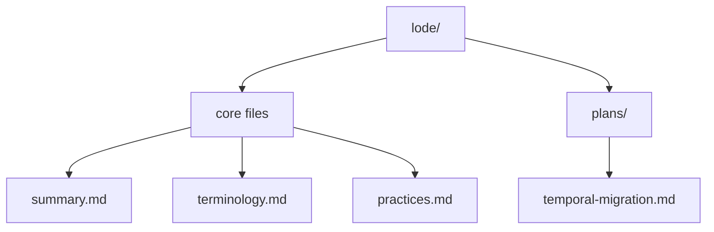

# Lode Map

- `lode/summary.md`
- `lode/terminology.md`
- `lode/practices.md`
- `lode/plans/temporal-migration.md`

## Invariants
- Every lode file covers one topic and stays under 250 lines.

## Contracts
- All new lode files must be added to this map.

## Rationale
- A single index keeps discovery consistent across sessions.

## Lessons
- Update the map before adding new domain folders.

## Code Example
```ts
export const lodeIndex = [
  "lode/summary.md",
  "lode/terminology.md",
  "lode/practices.md",
  "lode/plans/temporal-migration.md",
];
```

## Diagram


## Related
- [Summary](summary.md)
- [Temporal migration plan](plans/temporal-migration.md)
