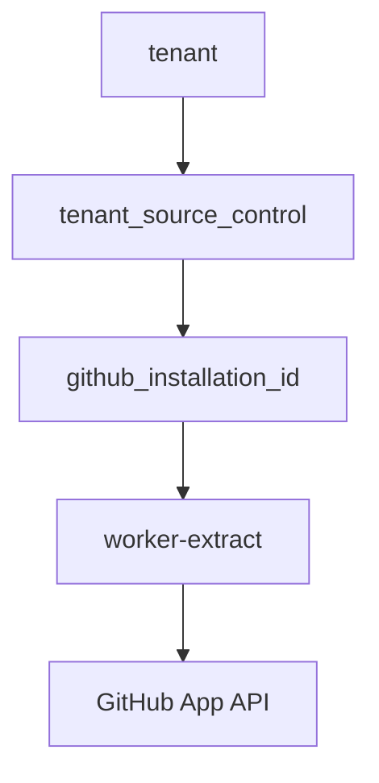

# GitHub App Auth

Extract workers use GitHub App authentication and no longer rely on Clerk or
GitLab. Each tenant maps to a GitHub App installation id stored in the super
database. Installation access tokens are generated on demand using the GitHub
App private key and app id from environment configuration.

## Invariants
- GitHub App private key stays in environment config, not the database.
- Each tenant must have at most one active GitHub App installation id.

## Contracts
- Super DB stores `tenant_source_control` records keyed by tenant id with
  `provider` and `github_installation_id` fields.
- Worker auth flow retrieves installation id before initializing GitHub client.
- GitLab auth paths are removed from extract worker runtime.

## Rationale
- Installation ids are tenant-specific and change on reinstallation, so the
  super DB is the canonical source of truth.
- GitHub App auth eliminates per-user OAuth token management.

## Lessons
- Keep auth metadata normalized per tenant to simplify future providers.

## Code Example
```ts
type TenantSourceControl = {
  tenantId: number;
  provider: "github";
  githubInstallationId: number;
};

const sourceControl = await getTenantSourceControl(db, tenantId, "github");
const installationId = sourceControl.githubInstallationId;
const token = await getGithubAppInstallationToken({
  appId: env.GITHUB_APP_ID,
  privateKey: env.GITHUB_APP_PRIVATE_KEY,
  installationId,
});
```

## Diagram


## Related
- [Extract auth](../stack/extract-auth.md)
- [Extract worker](../temporal/extract-worker.md)
- [Lode summary](../summary.md)
