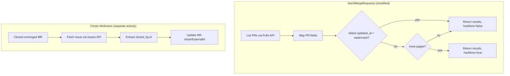

# GitHub PR Sync Migration

Migrate GitHub merge request ingestion from Search API to Pulls + Issues for
complete enumeration, PR-native fields, and stable pagination.

## Current Implementation (Before Migration)

Location: `packages/integrations/source-control/src/github/index.ts`

The current `fetchMergeRequests` method has two stages:

1. **Search API for pagination** (lines 361-451):
   - Calls `search.issuesAndPullRequests` with `type:pr+repo:{owner}/{repo}+updated:{range}`
   - Uses Search to calculate `totalPages` and page offset for time-period filtering
   - Problem: Search API is capped at 1,000 results per query

2. **Pulls API for data** (lines 474-536):
   - Calls `pulls.list` with `state=all&sort=updated&direction=desc`
   - Maps PR fields to `NewMergeRequestWithSha`

**Current field mapping issues:**
- `mergerExternalId`: NOT extracted (GitHub PRs have `merged_by` but it's ignored)
- `closerExternalId`: NOT extracted (would need Issues API)
- `mergeCommitSha`: Stored for ALL PRs, but for open PRs this is transient

**Parameter naming issue:**
- Interface parameter is `creationPeriod?: TimePeriod`
- Actually filters by `updated` date, not `created` date
- Internal variable renamed to `timePeriod` which is confusing

## Target Implementation

### Changes to `fetchMergeRequests`

1. **Remove Search API entirely** - use Pulls API pagination directly
2. **Watermark-based pagination stop**:
   - Paginate until oldest PR's `updated_at < period.from`
   - Or hit a configurable max page limit (safety bound)
3. **Extract `merged_by.id`** as `mergerExternalId` for merged PRs
4. **Only store `mergeCommitSha`** when `merged_at` is present
5. **Remove `totalPages` parameter** - no longer needed without Search

### New method: `fetchMergeRequestCloser`

For closed-unmerged PRs, closer attribution requires Issues API:
- Endpoint: `GET /repos/{owner}/{repo}/issues/{pull_number}`
- Extract: `closed_by.id` as `closerExternalId`
- Called per-PR from Temporal activity (not batched in fetchMergeRequests)

## Invariants

- `mergeCommitSha` is stored only for merged PRs (`merged_at` present).
- `mergerExternalId` requires `pulls.get` (not available in `pulls.list`).
- `closerExternalId` for closed-unmerged PRs comes from Issues `closed_by.id`.
- Open PRs have `closerExternalId = null`.

## Contracts

- Primary enumeration uses `GET /repos/{owner}/{repo}/pulls` with
  `state=all&sort=updated&direction=desc&per_page=100`.
- Pagination stops when `updated_at < period.from` or max pages reached.
- Closed-unmerged PRs require a separate Issues call:
  `GET /repos/{owner}/{repo}/issues/{pull_number}`.

## Rationale

- Search is capped at 1,000 results per query and returns issue-shaped data.
- Pulls list returns PR-native fields (`merged_by`) and supports full enumeration.
- Issues provide reliable closer attribution for closed-unmerged PRs.
- Watermark-based stop is simpler and doesn't require pre-counting.

## Migration Strategy

We use Option C: add new method `fetchMergeRequestsV2`, deprecate old method.

- `fetchMergeRequestsV2` has a clean interface with `hasMore` instead of `totalPages`
- `fetchMergeRequests` remains unchanged for now (backward compatible)
- Activities will be updated in a later step to use V2, then old method removed

## Implementation Tasks

1. [x] Add `fetchMergeRequestsV2` with watermark-based pagination (new method)
2. [x] Add `fetchMergeRequestMerger` method (`merged_by` not in `pulls.list`)
3. [x] Only store `mergeCommitSha` when `merged_at` is present in V2
4. [x] Add `fetchMergeRequestCloser` method for Issues API
5. [x] Update `SourceControl` interface with new methods
6. [ ] Add Temporal activity for merger/closer extraction
7. [ ] Update workflow to call merger/closer extraction
8. [ ] Update extract activities to use `fetchMergeRequestsV2`
9. [ ] Remove deprecated `fetchMergeRequests` after activities migrated

## Code Example

```ts
// fetchMergeRequestsV2 - watermark-based pagination, no Search API
async fetchMergeRequestsV2(
  externalRepositoryId: number,
  namespaceName: string,
  repositoryName: string,
  repositoryId: number,
  perPage: number,
  updatedAfter?: Date,
  page?: number,
): Promise<{
  mergeRequests: NewMergeRequestWithSha[];
  pagination: { page: number; perPage: number; hasMore: boolean };
  reachedWatermark: boolean;
}> {
  // ... calls pulls.list, maps fields, checks watermark
}

// merged_by requires pulls.get (not available in pulls.list)
async fetchMergeRequestMerger(
  namespaceName: string,
  repositoryName: string,
  pullNumber: number,
): Promise<{ mergerExternalId: number | null }> {
  const result = await this.api.pulls.get({ ... });
  return { mergerExternalId: result.data.merged_by?.id ?? null };
}

// closed_by comes from Issues API
async fetchMergeRequestCloser(
  namespaceName: string,
  repositoryName: string,
  pullNumber: number,
): Promise<{ closerExternalId: number | null }> {
  const result = await this.api.issues.get({ ... });
  return { closerExternalId: result.data.closed_by?.id ?? null };
}
```

## Diagram



## Related

- [Summary](../summary.md)
- [Practices](../practices.md)
- [Terminology](../terminology.md)
- [Extract worker](../temporal/extract-worker.md)
