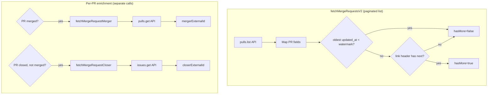

# GitHub PR Sync Migration

Migrate GitHub merge request ingestion from Search API to Pulls + Issues for
complete enumeration, PR-native fields, and stable pagination.

## New Methods (Implemented)

Location: `packages/integrations/source-control/src/github/index.ts`

Three new methods added to `GitHubSourceControl`:

### `fetchMergeRequestsV2`

Replaces `fetchMergeRequests` with watermark-based pagination (no Search API).

- Calls `pulls.list` with `state=all&sort=updated&direction=desc`
- Returns `hasMore` boolean instead of unreliable `totalPages`
- Returns `reachedWatermark` to indicate stop reason
- Only stores `mergeCommitSha` when `merged_at` is present
- Does NOT include `mergerExternalId` (not available in `pulls.list`)

### `fetchMergeRequestMerger`

Fetches merger info for merged PRs via `pulls.get` endpoint.

- Required because `pulls.list` doesn't include `merged_by` field
- Returns `{ mergerExternalId: number | null }`
- Call only for PRs where `mergedAt` is set

### `fetchMergeRequestCloser`

Fetches closer info for closed PRs via `issues.get` endpoint.

- PRs are Issues in GitHub, so we use Issues API for `closed_by`
- Returns `{ closerExternalId: number | null }`
- Call only for PRs where `closedAt` is set but `mergedAt` is null

## Legacy Method (Deprecated)

The old `fetchMergeRequests` method remains unchanged for backward compatibility.
It will be removed after activities are migrated to use `fetchMergeRequestsV2`.

## Invariants

- `mergeCommitSha` is stored only for merged PRs (`merged_at` present).
- `mergerExternalId` requires `pulls.get` (not available in `pulls.list`).
- `closerExternalId` for closed-unmerged PRs comes from Issues `closed_by.id`.
- Open PRs have `closerExternalId = null`.

## Contracts

- Primary enumeration uses `GET /repos/{owner}/{repo}/pulls` with
  `state=all&sort=updated&direction=desc&per_page=100`.
- Pagination stops when `updated_at < period.from` or max pages reached.
- Closed-unmerged PRs require a separate Issues call:
  `GET /repos/{owner}/{repo}/issues/{pull_number}`.

## Rationale

- Search is capped at 1,000 results per query and returns issue-shaped data.
- Pulls list returns PR-native fields (`merged_by`) and supports full enumeration.
- Issues provide reliable closer attribution for closed-unmerged PRs.
- Watermark-based stop is simpler and doesn't require pre-counting.

## Migration Strategy

Two-phase approach: Phase A adds merger/closer extraction to enrich existing data,
Phase B switches to V2 pagination.

### Phase A: Merger/Closer Extraction (Complete)

Add activities to fetch `mergerExternalId` and `closerExternalId` per-PR. This
works with the existing pagination and adds value immediately.

**Activities added:**

1. `extractMergeRequestMerger` - Calls `fetchMergeRequestMerger` for merged PRs
   - Uses `ExtractMergeRequestInput` (same as other MR activities)
   - Skips if PR is not merged or already has `mergerExternalId`
   - Updates `mergeRequests.mergerExternalId` in DB

2. `extractMergeRequestCloser` - Calls `fetchMergeRequestCloser` for closed-unmerged PRs
   - Uses `ExtractMergeRequestInput` (same as other MR activities)
   - Skips if PR is merged, still open, or already has `closerExternalId`
   - Updates `mergeRequests.closerExternalId` in DB

**Files created/modified:**

- `packages/functions/extract/src/get-merge-request-merger.ts` - Extract function
- `packages/functions/extract/src/get-merge-request-closer.ts` - Extract function
- `apps/workflows/src/types/activities.ts` - Interface additions
- `apps/worker-extract/src/activities/extract-activities.ts` - Activity implementations
- `apps/workflows/src/workflows/extract-merge-request.ts` - Workflow updated

### Phase B: V2 Pagination (Complete)

Replaced Search API pagination with watermark-based sequential pagination.

**Changes made:**

1. `getMergeRequestsV2` function in `packages/functions/extract/src/get-merge-requests-v2.ts`
   - Uses `fetchMergeRequestsV2` from source control
   - Accepts `updatedAfter?: Date` instead of `timePeriod`
   - Returns `{ hasMore, reachedWatermark }` instead of `totalPages`

2. `extractMergeRequestsV2` activity in `apps/worker-extract/src/activities/extract-activities.ts`
   - Wraps `getMergeRequestsV2` for Temporal
   - Input: `updatedAfter: number` (epoch ms)
   - Output: `{ mergeRequestIds, hasMore, reachedWatermark }`

3. `extractRepositoryWorkflow` in `apps/workflows/src/workflows/extract-repository.ts`
   - Sequential pagination loop instead of parallel `totalPages` batching
   - Stops when `!hasMore || reachedWatermark`

**Pagination approach:** Sequential (one page at a time). See
[parallel-pagination-option.md](./parallel-pagination-option.md) for future
parallel batching optimization if performance becomes a concern.

## Implementation Tasks

### Integration Layer (Complete)
1. [x] Add `fetchMergeRequestsV2` with watermark-based pagination (new method)
2. [x] Add `fetchMergeRequestMerger` method (`merged_by` not in `pulls.list`)
3. [x] Only store `mergeCommitSha` when `merged_at` is present in V2
4. [x] Add `fetchMergeRequestCloser` method for Issues API
5. [x] Update `SourceControl` interface with new methods

### Phase A: Merger/Closer Activities (Complete)
6. [x] Add `extractMergeRequestMerger` activity to `ExtractActivities` interface
7. [x] Add `extractMergeRequestCloser` activity to `ExtractActivities` interface
8. [x] Implement activities in `apps/worker-extract/src/activities/extract-activities.ts`
9. [x] Update `extractMergeRequestWorkflow` to call merger/closer activities

### Phase B: V2 Pagination (Complete)
10. [x] Create `getMergeRequestsV2` function in `packages/functions/extract`
11. [x] Create `extractMergeRequestsV2` activity
12. [x] Update `extractRepositoryWorkflow` to use `hasMore` pagination loop
13. [ ] Remove deprecated `fetchMergeRequests` after migration validated

## Code Example

```ts
// Workflow: sequential pagination with watermark-based early exit
async function extractMergeRequestsAndChildren(...) {
  const allMergeRequestIds = [...initialMergeRequestIds];
  let page = 1;
  let hasMore = true;

  while (hasMore) {
    const result = await extractMergeRequestsV2({
      ...baseInput,
      updatedAfter: input.timePeriod.from,
      page,
      perPage: DEFAULT_PER_PAGE,
    });

    allMergeRequestIds.push(...result.mergeRequestIds);

    if (!result.hasMore || result.reachedWatermark) {
      hasMore = false;
    } else {
      page++;
    }
  }
  // ... process unique MR IDs
}

// merged_by requires pulls.get (not available in pulls.list)
async fetchMergeRequestMerger(
  namespaceName: string,
  repositoryName: string,
  pullNumber: number,
): Promise<{ mergerExternalId: number | null }> {
  const result = await this.api.pulls.get({ ... });
  return { mergerExternalId: result.data.merged_by?.id ?? null };
}

// closed_by comes from Issues API
async fetchMergeRequestCloser(
  namespaceName: string,
  repositoryName: string,
  pullNumber: number,
): Promise<{ closerExternalId: number | null }> {
  const result = await this.api.issues.get({ ... });
  return { closerExternalId: result.data.closed_by?.id ?? null };
}
```

## Diagram



## Related

- [Summary](../summary.md)
- [Practices](../practices.md)
- [Terminology](../terminology.md)
- [Extract worker](../temporal/extract-worker.md)
