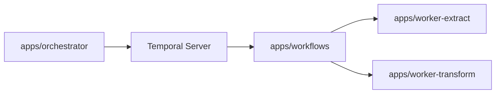

# Temporal Migration Plan

**Status: ✅ COMPLETED**

Goal: replace SST/AWS extract-transform infrastructure with Temporal on Railway
while keeping Drizzle and existing integrations intact.

## Current Architecture
- Temporal server runs on Railway (local dev via `temporal server start-dev`).
- Workflow definitions live in `apps/workflows`.
- Worker services live in `apps/worker-extract` and `apps/worker-transform`.
- Manual starts and schedule creation live in `apps/orchestrator`.
- Shared schemas, integrations, and activity logic remain in `packages/*`.
- Task queues: `extract` and `transform` (separate for independent scaling).

## Workflow Boundaries
- ExtractTenantsWorkflow orchestrates tenant/repo/MR fanout.
- ExtractInitialDeploymentsWorkflow covers the initial deployment extraction
  path.
- TransformTenantsWorkflow runs tenant transform + timeline transforms.

## Scheduling
- Extract schedule runs every 15 minutes with an offset (minute 8).
- Transform schedule runs every 15 minutes on the quarter-hour (minute 0).

## Environment Configuration
- Workers read credentials from environment variables (see `.env.example`).
- Zod schemas validate env at startup.

## Completed Phases
1. ✅ Baseline design: workflow/activity interfaces, workflow-only app structure.
2. ✅ Extract migration: activities + extract workflows complete.
3. ✅ Transform migration: activities + transformTenantsWorkflow + transformRepositoryWorkflow.
4. ✅ Scheduling/manual start: Temporal schedules + CLI commands in `apps/orchestrator`.
5. ✅ Remove SST/AWS infra: deleted `apps/stack` and related documentation.
6. ✅ Production rollout: workers deployed to Railway, schedules and visibility validated.

## Invariants
- Workflow code is deterministic and contains no I/O.
- Activities encapsulate all database and integration access.
- Temporal code stays under `apps/`, not `packages/`.

## Contracts
- Task queue names: `extract` for extract workers, `transform` for transform workers.
- Activity retry + timeout policies replace DLQ behavior.

## Rationale
- Railway-hosted Temporal reduces AWS coupling and consolidates orchestration.

## Lessons
- Prefer child workflows or fanout loops for complex fanout patterns.

## Code Example
```ts
import { proxyActivities } from "@temporalio/workflow";

import type { ExtractActivities } from "../types/activities";
import type { ExtractTenantsInput } from "../types/inputs";

const { extractTenants } = proxyActivities<ExtractActivities>({
  startToCloseTimeout: "10 minutes",
  retry: { initialInterval: "5 seconds", maximumAttempts: 10 },
});

export async function extractTenantsWorkflow(input: ExtractTenantsInput) {
  return extractTenants(input);
}
```

## Diagram


## Related
- [Summary](../summary.md)
- [Terminology](../terminology.md)
- [Practices](../practices.md)
- [Baseline design](../temporal/baseline-design.md)
- [Orchestrator](../temporal/orchestrator.md)
