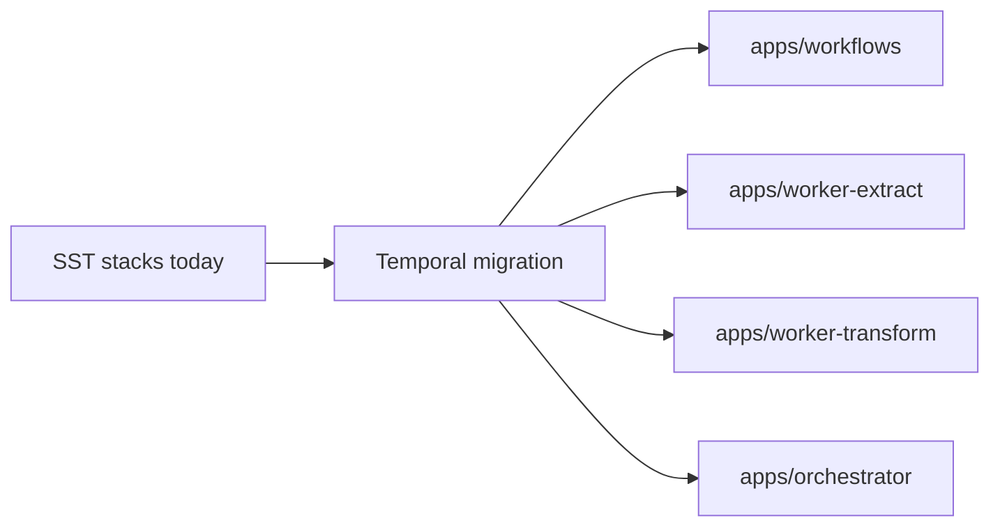

# Temporal Migration Plan

Goal: replace SST/AWS extract-transform infrastructure with Temporal on Railway
while keeping Drizzle and existing integrations intact.

## Current State (Source of Truth)
- SST stacks in `apps/stack/stacks/ExtractStack.ts` and
  `apps/stack/stacks/TransformStack.ts` own EventBus, SQS + DLQs, API Gateway
  routes, and cron schedules.
- Runtime configuration is managed via SST config/parameters.

## Target Architecture
- Temporal server runs on Railway (local dev via nix flake).
- Workflow definitions live in `apps/workflows`.
- Worker services live in `apps/worker-extract` and `apps/worker-transform`.
- Manual starts and schedule creation live in `apps/orchestrator`.
- Shared schemas, integrations, and activity logic remain in `packages/*`.
- Task queues: `extract` and `transform` (separate for independent scaling).

## Workflow Boundaries
- ExtractTenantsWorkflow orchestrates tenant/repo/MR fanout using activities that
  map to existing extract handlers in `apps/stack/src/extract/*`.
- ExtractInitialDeploymentsWorkflow covers the initial deployment extraction
  path.
- TransformTenantWorkflow runs tenant transform + timeline transforms.

## Scheduling
- Temporal schedules replace SST cron rules.
- Extract schedule runs every 15 minutes with an offset (minute 8).
- Transform schedule runs every 15 minutes on the quarter-hour (minute 0).

## Env Migration
- Move SST config/secret values to Railway environment variables.
- Introduce a shared config module for activities to validate env values.

## Plan Phases
1. ✅ Baseline design: workflow/activity interfaces, workflow-only app structure.
2. 🔄 Extract migration: activities + ExtractTenantsWorkflow (in progress).
3. ⏳ Transform migration: activities + TransformTenantWorkflow.
4. ⏳ Scheduling/manual start: Temporal schedules + client entrypoints.
5. ⏳ Remove SST/AWS infra: delete stacks and SST config.
6. ⏳ Production rollout: deploy workers, validate schedules and visibility.

## Invariants
- Workflow code is deterministic and contains no I/O.
- Activities encapsulate all database and integration access.
- Temporal code stays under `apps/`, not `packages/`.

## Contracts
- Task queue names: `extract` for extract workers, `transform` for transform workers.
- Activity retry + timeout policies replace DLQ behavior.

## Rationale
- Railway-hosted Temporal reduces AWS coupling and consolidates orchestration.

## Lessons
- Prefer child workflows or fanout loops over SQS fanout patterns.

## Code Example
```ts
import { proxyActivities } from "@temporalio/workflow";

import type { ExtractActivities } from "../types/activities";
import type { ExtractTenantsInput } from "../types/inputs";

const { extractTenants } = proxyActivities<ExtractActivities>({
  startToCloseTimeout: "10 minutes",
  retry: { initialInterval: "5 seconds", maximumAttempts: 10 },
});

export async function extractTenantsWorkflow(input: ExtractTenantsInput) {
  return extractTenants(input);
}
```

## Diagram


## Related
- [Summary](../summary.md)
- [Terminology](../terminology.md)
- [Practices](../practices.md)
- [Baseline design](../temporal/baseline-design.md)
