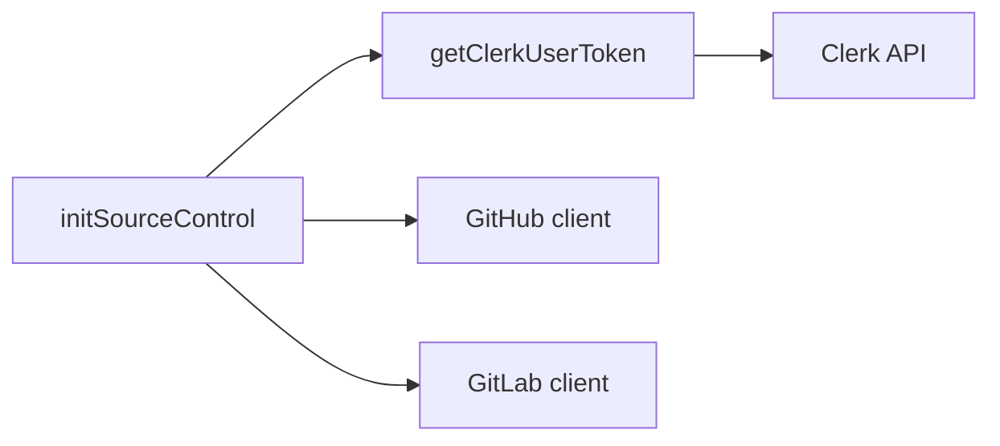

# Extract Auth Tokens

Extract runtime source-control clients fetch Clerk OAuth tokens directly from
Clerk on demand. There is no Redis-backed token cache; each initialization uses
the latest token from Clerk.

## Invariants
- Extract source-control initialization always requests a fresh token from
  Clerk.
- Token retrieval errors are surfaced to callers.

## Contracts
- `getClerkUserToken` accepts a Clerk user id and provider id
  (`oauth_github` or `oauth_gitlab`).
- Source-control initialization uses `getClerkUserToken` before constructing
  GitHub or GitLab clients.

## Rationale
- Removing the Redis cache eliminates stale token risk and simplifies
  infrastructure dependencies during the migration.

## Lessons
- Token fetches must stay lightweight enough for per-request initialization.

## Code Example
```ts
import { getClerkUserToken } from "./get-clerk-user-token";

const token = await getClerkUserToken("user_123", "oauth_github");
```

## Diagram


## Related
- [Stack summary](summary.md)
- [Lode summary](../summary.md)
