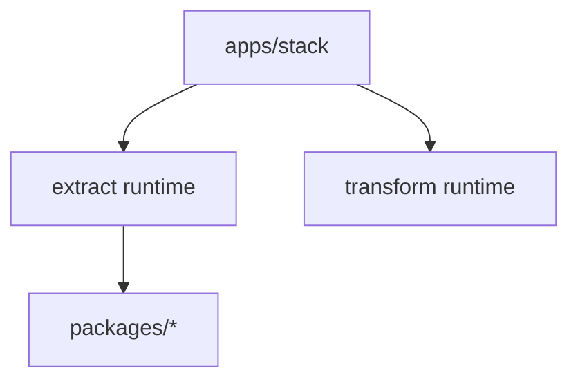

# Stack Summary

The SST stack in `apps/stack` still defines the production infrastructure for
extract and transform pipelines while Temporal migration continues. Stack code
configures database access, source-control clients, and runtime configuration
used by the existing AWS-first workloads.

## Invariants
- `apps/stack` remains the source of truth for running extract/transform until
  the Temporal workers fully replace it.
- Stack runtime code prefers shared logic from `packages/` when possible.

## Contracts
- Stack runtime configuration is sourced from `sst/node/config` bindings.
- Extract helpers expose explicit entry points for database and source control
  initialization.

## Rationale
- Keeping stack behavior documented avoids drift during the Temporal migration.

## Lessons
- Centralizing stack conventions simplifies cutover planning.

## Code Example
```ts
import { initDatabase, initSourceControl } from "./extract/context";

const db = initDatabase({ dbUrl: "libsql://tenant-db" });
const sourceControl = await initSourceControl({
  userId: "user_123",
  sourceControl: "github",
});
```

## Diagram


## Related
- [Extract auth](extract-auth.md)
- [Lode summary](../summary.md)
