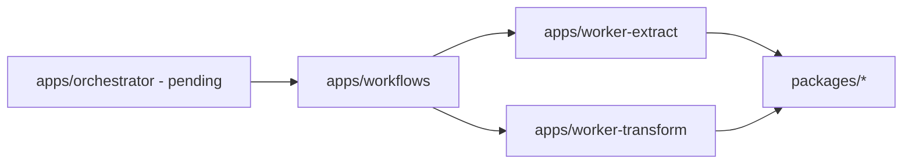

# Lode Summary

This repo is a TypeScript monorepo that currently runs extract/transform
pipelines via SST stacks in `apps/stack`, with an active migration to Temporal
on Railway. Extract pipeline migration is complete: `apps/workflows` contains
workflow definitions (`extractTenantsWorkflow`, `extractRepositoryWorkflow`,
`extractMergeRequestWorkflow`) and `apps/worker-extract` implements all 17
extract activities. Transform pipeline migration is complete: `apps/workflows`
contains `transformTenantsWorkflow` and `transformRepositoryWorkflow`, and
`apps/worker-transform` implements 2 transform activities. Orchestrator and
scheduling are pending. Drizzle and integrations remain in `packages/`. GitHub
Actions workflows are currently removed; CI/CD is pending. The Nix dev shell
includes Node.js, pnpm, Biome, git, and jq.

## Invariants
- Source of truth for current infra remains `apps/stack` until Temporal workers ship.
- Workflow code is deterministic and lives only in `apps/workflows`.
- Activities encapsulate all I/O and can use `packages/functions`,
  `packages/integrations`, and `packages/schemas`.
- Task queues: `extract` for extract pipeline, `transform` for transform pipeline.

## Contracts
- Workers connect via `TEMPORAL_ADDRESS` and `TEMPORAL_NAMESPACE`.
- Extract workers poll `extract` queue; transform workers poll `transform` queue.

## Rationale
- Temporal on Railway replaces AWS-only infra while preserving existing data and
  integrations.

## Lessons
- Fanout and orchestration stay in workflows; retries/timeouts replace DLQs.

## Code Example
```ts
export interface ExtractTenantsInput {
  tenantId?: number;
  sourceControl?: "github" | "gitlab";
  timePeriod: { from: Date; to: Date };
}
```

## Diagram


## Related
- [Temporal migration plan](plans/temporal-migration.md)
- [Baseline design](temporal/baseline-design.md)
- [Terminology](terminology.md)
- [Practices](practices.md)
