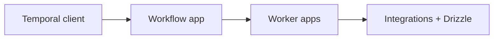

# Lode Summary

This repo is a TypeScript monorepo that currently runs extract/transform
pipelines via SST stacks in `apps/stack`, with a planned migration to Temporal
on Railway that introduces workflow/worker apps under `apps/` and keeps Drizzle
and integrations in `packages/`. The migration plan is tracked in
`lode/plans/temporal-migration.md` and will replace EventBus/SQS/API Gateway/Cron
with Temporal workflows, activities, and schedules.

## Invariants
- Source of truth for current infra remains `apps/stack` until Temporal workers ship.
- Workflow code is deterministic and lives only in `apps/temporal-workflows`.
- Activities encapsulate all I/O and can use `packages/functions`,
  `packages/integrations`, and `packages/schemas`.

## Contracts
- Workers connect via `TEMPORAL_ADDRESS` and `TEMPORAL_NAMESPACE`.
- Task queue name stays consistent across workers (default: `pipeline`).

## Rationale
- Temporal on Railway replaces AWS-only infra while preserving existing data and
  integrations.

## Lessons
- Fanout and orchestration stay in workflows; retries/timeouts replace DLQs.

## Code Example
```ts
export interface ExtractTenantsInput {
  tenantId?: string;
  sourceControl?: "github" | "gitlab";
  runMode: "full" | "incremental";
}
```

## Diagram


## Related
- [Temporal migration plan](plans/temporal-migration.md)
- [Terminology](terminology.md)
- [Practices](practices.md)
