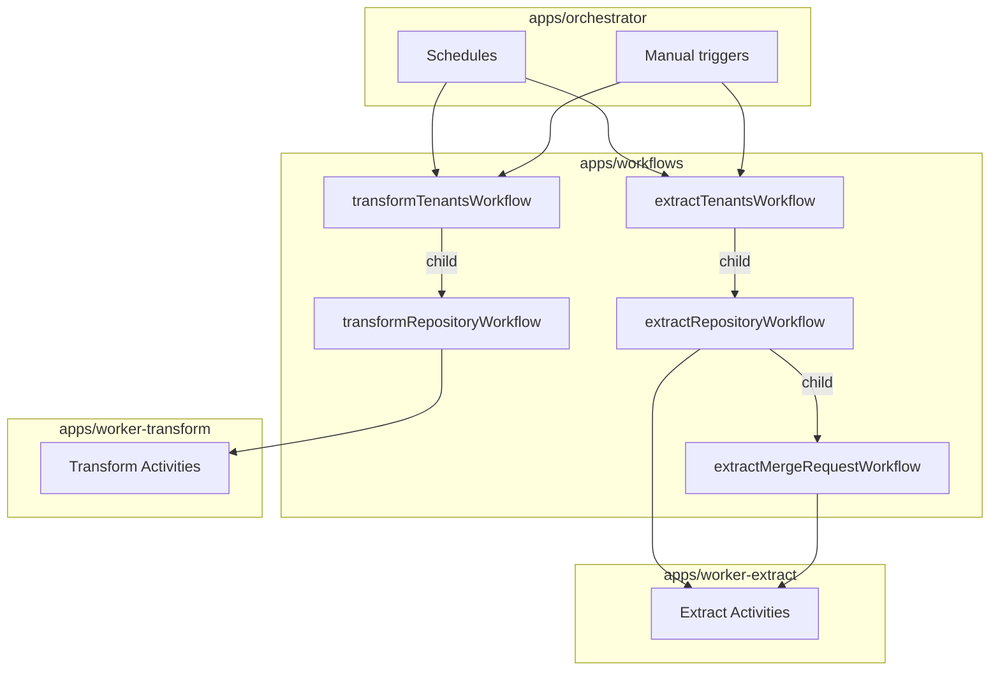

# Temporal Baseline Design

This document defines the foundational structure for the Temporal migration:
app layout, task queues, workflow/activity interfaces, and orchestration patterns.

## App Structure

```
apps/
  workflows/           # Workflow definitions (deterministic, no I/O)
  worker-extract/      # Extract worker (polls 'extract' queue)
  worker-transform/    # Transform worker (polls 'transform' queue)
  orchestrator/        # Manual starts + schedule management
```

All Temporal apps live under `apps/`. Shared logic remains in `packages/`.

## Task Queues

| Queue | Purpose | Worker |
|-------|---------|--------|
| `extract` | Extract pipeline activities | `worker-extract` |
| `transform` | Transform pipeline activities | `worker-transform` |

Separate queues enable independent scaling of extract vs transform workloads.

## Workflows

### Extract Workflows

| Workflow | Entry Point | Fanout |
|----------|-------------|--------|
| `extractTenantsWorkflow` | Schedule/manual | Iterates tenants → child `extractRepositoryWorkflow` |
| `extractRepositoryWorkflow` | Child | MRs, members, deployments fanout |
| `extractMergeRequestWorkflow` | Child | Diffs, commits, notes, timeline events |
| `extractInitialDeploymentsWorkflow` | Manual | Deployment backfill for a single repo |

### Transform Workflows

| Workflow | Entry Point | Fanout |
|----------|-------------|--------|
| `transformTenantsWorkflow` | Schedule/manual | Iterates tenants → child `transformRepositoryWorkflow` |
| `transformRepositoryWorkflow` | Child | Timeline transforms per MR |

## Activity Interfaces

### Extract Activities

```ts
interface ExtractActivities {
  // Discovery
  getTenants(): Promise<Tenant[]>;
  getRepositoriesForTenant(input: GetRepositoriesInput): Promise<Repository[]>;

  // Repository extraction (returns IDs for fanout)
  extractRepository(input: ExtractRepositoryInput): Promise<ExtractRepositoryResult>;

  // Merge request extraction
  extractMergeRequests(input: ExtractMergeRequestsInput): Promise<ExtractMergeRequestsResult>;
  extractMergeRequestDiffs(input: ExtractMergeRequestDiffsInput): Promise<void>;
  extractMergeRequestCommits(input: ExtractMergeRequestCommitsInput): Promise<void>;
  extractMergeRequestNotes(input: ExtractMergeRequestNotesInput): Promise<void>;
  extractTimelineEvents(input: ExtractTimelineEventsInput): Promise<void>;

  // Member extraction
  extractMembers(input: ExtractMembersInput): Promise<ExtractMembersResult>;
  extractNamespaceMembers(input: ExtractNamespaceMembersInput): Promise<void>;
  extractMemberInfo(input: ExtractMemberInfoInput): Promise<void>;

  // Deployment extraction
  extractDeployments(input: ExtractDeploymentsInput): Promise<ExtractDeploymentsResult>;
  extractDeploymentStatus(input: ExtractDeploymentStatusInput): Promise<void>;
  extractWorkflowDeployments(input: ExtractWorkflowDeploymentsInput): Promise<void>;
  extractWorkflowDeploymentStatus(input: ExtractWorkflowDeploymentStatusInput): Promise<void>;
  extractDefaultBranchCommits(input: ExtractDefaultBranchCommitsInput): Promise<void>;
}
```

### Transform Activities

```ts
interface TransformActivities {
  getRepositoriesForTenant(input: GetRepositoriesInput): Promise<Repository[]>;
  getMergeRequestsForTransform(input: GetMergeRequestsInput): Promise<MergeRequestDeployment[]>;
  transformTimeline(input: TransformTimelineInput): Promise<void>;
}
```

## Orchestration Patterns

### Child Workflow Fanout

Replace EventBus fanout with child workflows for complex sub-pipelines:

```ts
export async function extractRepositoryWorkflow(input: ExtractRepositoryInput) {
  const result = await extractRepository(input);

  // Parallel child workflows for each MR
  await Promise.all(
    result.mergeRequestIds.map((mrId) =>
      executeChild(extractMergeRequestWorkflow, {
        args: [{ mergeRequestId: mrId, ...input }],
        workflowId: `extract-mr-${input.repositoryId}-${mrId}`,
      })
    )
  );
}
```

### Activity Loop

Use activity loops for simpler fanout (no sub-orchestration needed):

```ts
export async function extractMergeRequestWorkflow(input: ExtractMergeRequestInput) {
  await extractMergeRequestDiffs(input);
  await extractMergeRequestCommits(input);
  await extractMergeRequestNotes(input);

  if (input.sourceControl === "github") {
    await extractTimelineEvents(input);
  }
}
```

## Retry and Timeout Strategy

Activity options replace DLQ behavior:

```ts
const defaultActivityOptions = {
  startToCloseTimeout: "10 minutes",
  retry: {
    initialInterval: "5 seconds",
    backoffCoefficient: 2,
    maximumInterval: "1 minute",
    maximumAttempts: 10,
  },
};
```

Long-running activities (e.g., large repo extraction) use heartbeats:

```ts
const longRunningActivityOptions = {
  startToCloseTimeout: "30 minutes",
  heartbeatTimeout: "1 minute",
  retry: {
    initialInterval: "10 seconds",
    maximumAttempts: 5,
  },
};
```

## Environment Variables

| Variable | Description |
|----------|-------------|
| `TEMPORAL_ADDRESS` | Temporal server address (local: `localhost:7233`, via `temporal server start-dev`) |
| `TEMPORAL_NAMESPACE` | Temporal namespace (default: `default`) |
| `TENANT_DATABASE_AUTH_TOKEN` | Turso auth token for tenant DBs |
| `SUPER_DATABASE_URL` | Super DB URL |
| `SUPER_DATABASE_AUTH_TOKEN` | Super DB auth token |
| `GITHUB_APP_ID` | GitHub App id |
| `GITHUB_APP_PRIVATE_KEY` | GitHub App private key |
| `PER_PAGE` | Pagination size (default: 30) |

## Scheduling

Temporal schedules replace SST Cron rules:

| Schedule ID | Workflow | Interval | Offset |
|-------------|----------|----------|--------|
| `extract-tenants-schedule` | `extractTenantsWorkflow` | 15 min | minute 8 |
| `transform-tenants-schedule` | `transformTenantsWorkflow` | 15 min | minute 0 |

## Invariants

- Workflow code is deterministic and contains no I/O.
- Activities encapsulate all database and integration access.
- Temporal apps stay under `apps/`, not `packages/`.
- Each workflow has a deterministic `workflowId` to enable idempotency.

## Contracts

- Task queue names: `extract` and `transform`.
- Workers register all activities for their respective queue.
- Activity retry policies replace DLQ behavior.

## Rationale

- Separate task queues match the existing Extract/Transform split.
- Child workflows provide visibility and retry boundaries for sub-pipelines.
- Activity loops simplify cases where sub-orchestration is unnecessary.

## Lessons

- Prefer child workflows over deeply nested activity fanout for observability.
- Use `workflowId` patterns like `extract-repo-{tenantId}-{repoId}` to prevent duplicates.

## Diagram



## Related

- [Summary](../summary.md)
- [Migration plan](../plans/temporal-migration.md)
- [Terminology](../terminology.md)
- [Practices](../practices.md)
