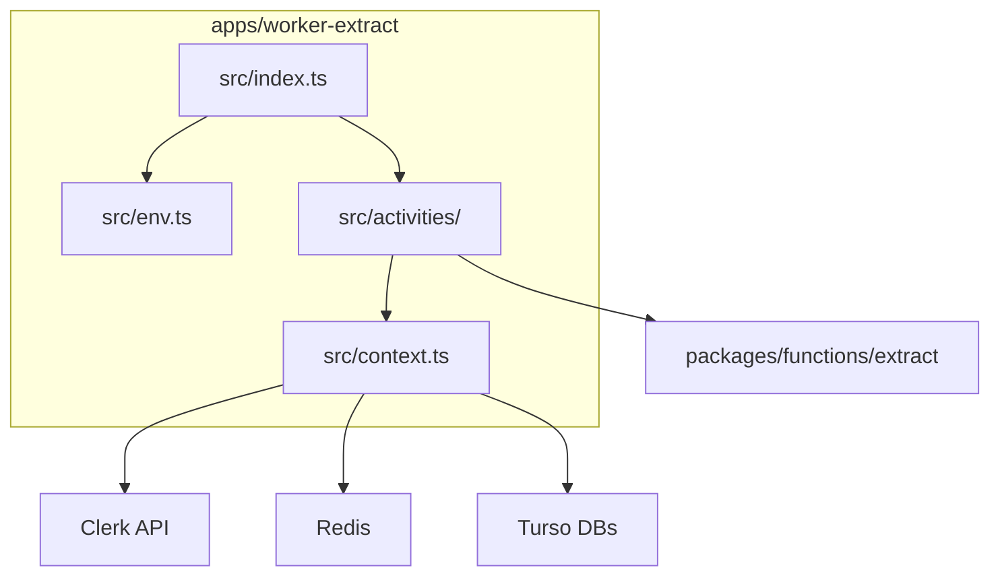

# Extract Worker Implementation

The extract worker (`apps/worker-extract`) executes extract activities for the
Temporal-based pipeline. It polls the `extract` task queue and runs activities
that fetch data from GitHub/GitLab APIs and store it in tenant databases.

## Structure

```
apps/worker-extract/
  src/
    index.ts              # Worker entry point
    env.ts                # Environment variable validation
    context.ts            # Database and source control initialization
    activities/
      extract-activities.ts  # All extract activity implementations
      index.ts
```

## Environment Variables

| Variable | Description | Default |
|----------|-------------|---------|
| `TEMPORAL_ADDRESS` | Temporal server address | `localhost:7233` |
| `TEMPORAL_NAMESPACE` | Temporal namespace | `default` |
| `TENANT_DATABASE_AUTH_TOKEN` | Turso auth token for tenant DBs | required |
| `SUPER_DATABASE_URL` | Super DB URL | required |
| `SUPER_DATABASE_AUTH_TOKEN` | Super DB auth token | required |
| `CLERK_SECRET_KEY` | Clerk API key for user tokens | required |
| `REDIS_URL` | Redis URL for token caching | required |
| `REDIS_TOKEN` | Redis auth token | required |
| `REDIS_USER_TOKEN_TTL` | Token cache TTL in seconds | `1200` |
| `PER_PAGE` | Pagination size | `30` |
| `FETCH_TIMELINE_EVENTS_PER_PAGE` | Timeline events page size | `1000` |

## Activities

All activities are defined in `extractActivities` object and implement the
`ExtractActivities` interface from `@dxta/workflows`.

| Activity | Purpose |
|----------|---------|
| `getTenants` | Fetch tenants from super database |
| `getRepositoriesForTenant` | List repositories for a tenant |
| `extractRepository` | Extract repository metadata, create crawl instance |
| `extractMergeRequests` | Extract merge requests for a repository |
| `extractMergeRequestDiffs` | Extract diffs for a merge request |
| `extractMergeRequestCommits` | Extract commits for a merge request |
| `extractMergeRequestNotes` | Extract notes/comments for a merge request |
| `extractTimelineEvents` | Extract GitHub timeline events (GitHub only) |
| `extractMembers` | Extract repository members |
| `extractMemberInfo` | Extract detailed member info |
| `extractNamespaceMembers` | Extract namespace/org members |
| `extractDeployments` | Extract deployments for a repository |
| `extractDeploymentStatus` | Extract deployment status |
| `extractDefaultBranchCommits` | Extract commits on default branch |
| `extractWorkflowDeployments` | Extract GitHub workflow deployments |
| `extractWorkflowDeploymentStatus` | Extract workflow deployment status |

## Context Initialization

The worker reuses patterns from `apps/stack/src/extract/context.ts`:

- `initDatabase(dbUrl)` - Creates a Drizzle client for a tenant database
- `initSuperDatabase()` - Creates a Drizzle client for the super database
- `initSourceControl({ userId, sourceControl })` - Creates GitHub/GitLab client
- `getClerkUserToken(userId, provider)` - Fetches OAuth token with Redis caching

## Running the Worker

```bash
# Development
pnpm run dev --workspace @dxta/worker-extract

# Production
pnpm run build --workspace @dxta/worker-extract
pnpm run start --workspace @dxta/worker-extract
```

## Invariants

- Activities must not import from `@temporalio/workflow` (non-deterministic).
- All I/O happens in activities, never in workflows.
- Token caching via Redis prevents excessive Clerk API calls.

## Contracts

- Worker polls `extract` task queue.
- Workflows are loaded from `@dxta/workflows` package.
- Activity functions match `ExtractActivities` interface exactly.

## Rationale

- Porting from SST handlers preserves existing extract logic.
- Shared `packages/functions/extract` functions reduce duplication.
- Environment validation via Zod catches config errors at startup.

## Lessons

- Activities should be granular for better retry isolation.
- Child workflows provide better visibility than deeply nested activities.

## Code Example

```ts
const worker = await Worker.create({
  connection,
  namespace: env.TEMPORAL_NAMESPACE,
  taskQueue: "extract",
  workflowsPath: require.resolve("@dxta/workflows"),
  activities: extractActivities,
});
```

## Diagram



## Related

- [Baseline design](baseline-design.md)
- [Migration plan](../plans/temporal-migration.md)
- [Summary](../summary.md)
