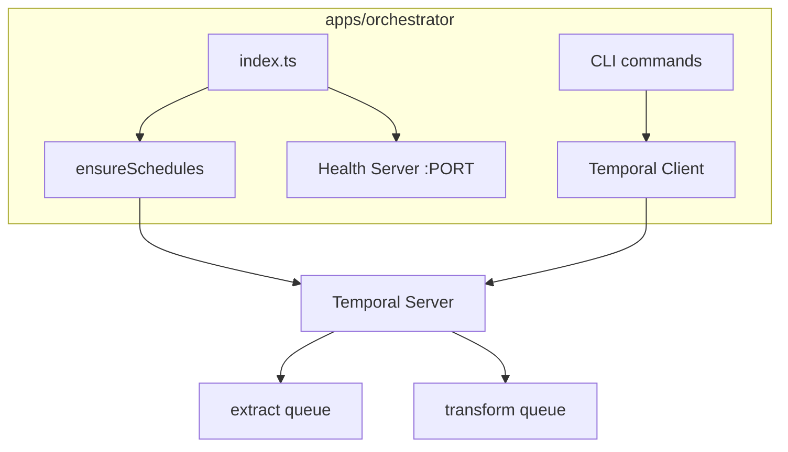

# Orchestrator

The orchestrator (`apps/orchestrator`) manages Temporal schedules and provides
CLI commands for manual workflow triggers. It runs as a long-lived service on
Railway with a health check endpoint.

## Structure

```
apps/orchestrator/
├── src/
│   ├── index.ts           # Entry point: ensures schedules + health server
│   ├── client.ts          # Temporal Client connection
│   ├── env.ts             # Environment validation
│   ├── schedules.ts       # Schedule creation/management
│   └── commands/
│       ├── start-extract.ts    # CLI for manual extract trigger
│       └── start-transform.ts  # CLI for manual transform trigger
├── package.json
└── tsconfig.json
```

## Schedules

Two schedules are created on startup (idempotent):

| Schedule ID | Cron | Task Queue | Workflow |
|-------------|------|------------|----------|
| `extract-tenants-schedule` | `8 */15 * * *` | `extract` | `extractTenantsWorkflow` |
| `transform-tenants-schedule` | `0 */15 * * *` | `transform` | `transformTenantsWorkflow` |

Both use `ALLOW_ALL` overlap policy (concurrent runs permitted).

Time period is a rolling 15-minute window in epoch milliseconds:
`{ from: now - 15min, to: now }`.

## CLI Commands

```bash
# Start extract workflow (all tenants, last 15 minutes)
pnpm --filter ./apps/orchestrator start:extract

# Start extract for specific tenant
pnpm --filter ./apps/orchestrator start:extract --tenantId=123

# Start extract with custom time range
pnpm --filter ./apps/orchestrator start:extract --from=2024-01-01T00:00:00Z --to=2024-01-01T01:00:00Z

# Start transform workflow
pnpm --filter ./apps/orchestrator start:transform
pnpm --filter ./apps/orchestrator start:transform --tenantId=123
```

## Environment Variables

| Variable | Default | Description |
|----------|---------|-------------|
| `TEMPORAL_ADDRESS` | `localhost:7233` | Temporal server address |
| `TEMPORAL_NAMESPACE` | `default` | Temporal namespace |
| `PORT` | `3000` | Health check server port |
| `EXTRACT_SCHEDULE_ENABLED` | `true` | Enable extract schedule |
| `TRANSFORM_SCHEDULE_ENABLED` | `true` | Enable transform schedule |

## Health Check

The orchestrator exposes `GET /health` returning `200 OK` with
`{"status":"ok"}`. Railway uses this to verify the service is healthy before
routing traffic.

## Invariants

- Schedules are created idempotently on startup (skip if exists).
- CLI commands generate unique workflow IDs: `{type}-manual-{timestamp}`.
- Health server listens on `PORT` env var (required by Railway).

## Contracts

- Orchestrator uses Temporal `Client` (not `NativeConnection` like workers).
- Schedules reference workflow types by string name, not import.

## Rationale

- Schedules live in Temporal server, not in application code/cron.
- Health endpoint required for Railway zero-downtime deploys.
- CLI commands enable local testing without schedule interference.

## Lessons

- `ScheduleClient.create()` throws if schedule exists; check first with `describe()`.
- Rolling time window calculated at schedule trigger time, not creation time.

## Code Example

```ts
// Manual workflow trigger
const from = Date.now() - 15 * 60 * 1000;
const to = Date.now();

const handle = await client.workflow.start("extractTenantsWorkflow", {
  taskQueue: "extract",
  workflowId: `extract-tenants-manual-${Date.now()}`,
  args: [{ timePeriod: { from, to } }],
});
```

## Diagram



## Related

- [Temporal migration plan](../plans/temporal-migration.md)
- [Extract worker](extract-worker.md)
- [Transform worker](transform-worker.md)
- [Baseline design](baseline-design.md)
