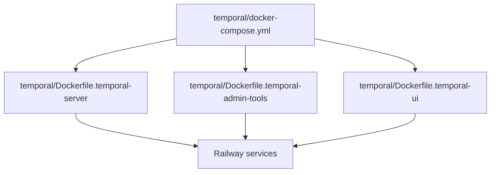

# Temporal Railway Images

Temporal infrastructure services on Railway use small wrapper images to bundle
dynamic config and scripts alongside the upstream Temporal images. These images
cover `temporal`, `temporal-admin-tools` (also used for namespace creation), and
`temporal-ui` from `temporal/docker-compose.yml`.

## Invariants

- Dynamic config is baked into the Temporal server image at
  `/etc/temporal/config/dynamicconfig`.
- Admin-tools scripts live in `/scripts` and are executable via
  `COPY --chmod=755`.
- Postgres runs as a managed Railway database, not as a Docker image.

## Contracts

- Build args `TEMPORAL_VERSION`, `TEMPORAL_ADMINTOOLS_VERSION`, and
  `TEMPORAL_UI_VERSION` control the base image tags.
- `DYNAMIC_CONFIG_FILE_PATH` remains
  `config/dynamicconfig/development-sql.yaml` at runtime.
- Namespace creation uses the same admin-tools image with
  `/scripts/create-namespace.sh` as the start command.

## Rationale

- Railway does not support the local volume mounts used in docker-compose.
- Baking config/scripts into images avoids missing assets at runtime.

## Lessons

- Keep these wrappers minimal so upstream Temporal updates stay simple.
- Prefer build args over hardcoded tags to match docker-compose versions.

## Code Example

```dockerfile
ARG TEMPORAL_VERSION=latest
FROM temporalio/server:${TEMPORAL_VERSION}

COPY temporal/dynamicconfig /etc/temporal/config/dynamicconfig

ARG TEMPORAL_ADMINTOOLS_VERSION=latest
FROM temporalio/admin-tools:${TEMPORAL_ADMINTOOLS_VERSION}

COPY --chmod=755 temporal/scripts /scripts
```

## Diagram



## Related

- [Docker images](../tooling/docker-images.md)
- [Temporal baseline design](baseline-design.md)
- [Lode summary](../summary.md)
