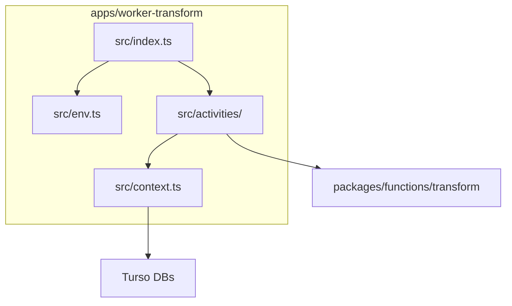

# Transform Worker Implementation

The transform worker (`apps/worker-transform`) executes transform activities for
the Temporal-based pipeline. It polls the `transform` task queue and runs
activities that compute metrics from extracted data and store them in tenant
databases.

## Structure

```
apps/worker-transform/
  src/
    index.ts              # Worker entry point
    env.ts                # Environment variable validation
    context.ts            # Database initialization
    activities/
      transform-activities.ts  # All transform activity implementations
      index.ts
```

## Environment Variables

| Variable | Description | Default |
|----------|-------------|---------|
| `TEMPORAL_ADDRESS` | Temporal server address | `localhost:7233` |
| `TEMPORAL_NAMESPACE` | Temporal namespace | `default` |
| `TENANT_DATABASE_AUTH_TOKEN` | Turso auth token for tenant DBs | required |
| `SUPER_DATABASE_URL` | Super DB URL | required |
| `SUPER_DATABASE_AUTH_TOKEN` | Super DB auth token | required |

## Activities

All activities are defined in `transformActivities` object and implement the
`TransformActivities` interface from `@dxta/workflows`.

| Activity | Returns | Purpose |
|----------|---------|---------|
| `getMergeRequestDeploymentPairs` | `MergeRequestDeploymentPair[]` | Query MR-deployment pairs for a time window |
| `transformMergeRequest` | `void` | Compute and store metrics for a single MR |

### getMergeRequestDeploymentPairs

Wraps `selectMergeRequestsDeployments()` from `@dxta/transform-functions`. Uses
a complex recursive CTE to find which merge requests were deployed in a given
time period, returning pairs of `{ mergeRequestId, deploymentId }`.

### transformMergeRequest

Wraps `run()` from `@dxta/transform-functions`. This is the main transform
logic that:
- Reads extract data (MR, diffs, commits, timeline events, notes, deployments)
- Calculates timeline metrics (coding duration, pickup duration, review duration)
- Calculates MR size, code additions/deletions
- Upserts transform tables (repositories, branches, merge_requests, forge_users)
- Upserts merge_request_metrics and related junk tables

## Shared Activities

The transform worker reuses `getTenants` and `getRepositoriesForTenant` from
the extract worker via the shared `ExtractActivities` interface. This avoids
duplicating tenant/repo discovery logic.

## Running the Worker

```bash
# Development
pnpm --filter @dxta/worker-transform dev

# Production
pnpm --filter @dxta/worker-transform build
pnpm --filter @dxta/worker-transform start
```

## Invariants

- Activities must not import from `@temporalio/workflow` (non-deterministic).
- All I/O happens in activities, never in workflows.
- Transform only supports GitHub repositories (GitLab skipped).
- The `run()` function is idempotent (upserts), safe to retry.

## Contracts

- Worker polls `transform` task queue.
- Workflows are loaded from `@dxta/workflows` package.
- Activity functions match `TransformActivities` interface exactly.

## Rationale

- Porting from SST handlers preserves existing transform logic.
- Shared `packages/functions/transform` functions reduce duplication.
- Environment validation via Zod catches config errors at startup.
- Simpler than extract: no pagination, no per-MR child workflows needed.

## Lessons

- Transform is simpler than extract: single query returns all work items.
- `run()` handles a single MR - parallelization happens at workflow level.

## Code Example

```ts
const worker = await Worker.create({
  connection,
  namespace: env.TEMPORAL_NAMESPACE,
  taskQueue: "transform",
  workflowsPath: require.resolve("@dxta/workflows"),
  activities: transformActivities,
});
```

## Diagram



## Related

- [Extract worker](extract-worker.md)
- [Baseline design](baseline-design.md)
- [Migration plan](../plans/temporal-migration.md)
- [Summary](../summary.md)
