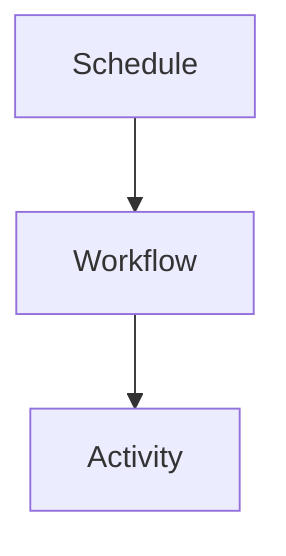

# Terminology

Temporal - workflow engine used for orchestration on Railway.
Workflow - deterministic orchestration code in `apps/temporal-workflows`.
Activity - I/O function executed by workers.
Worker - Temporal service hosting activities and polling a task queue.
Task queue - name workers poll (default: `pipeline`).
Schedule - Temporal schedule that starts workflows on a cadence.
ExtractTenantsWorkflow - main extract fanout workflow.
TransformTenantWorkflow - main transform workflow.
SST stacks - current AWS infra in `apps/stack`.
Railway - hosting platform for Temporal server and workers.

## Invariants
- Terminology reflects current architecture direction and workflow names.

## Contracts
- Workflow and activity names align with exported functions.

## Rationale
- Shared vocabulary reduces mistakes when mapping AWS constructs to Temporal.

## Lessons
- "Workflow" means orchestration only; "activity" means I/O.

## Code Example
```ts
export type RunMode = "full" | "incremental";
```

## Diagram


## Related
- [Summary](summary.md)
- [Temporal migration plan](plans/temporal-migration.md)
