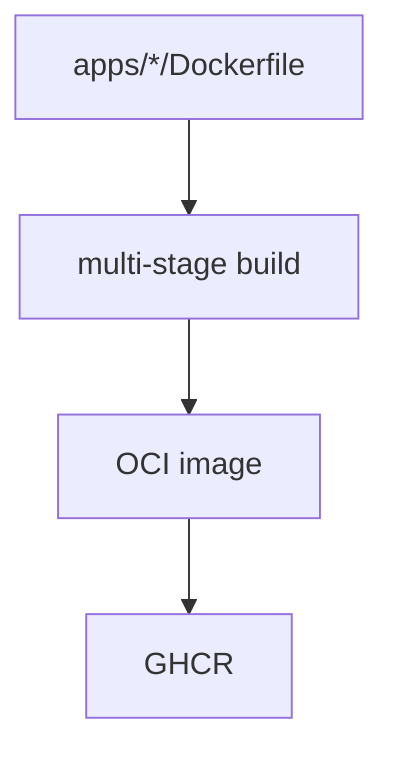

# Docker Images

Deployment images are built with multi-stage Dockerfiles. Each service has its
own Dockerfile in its app directory, optimized for pnpm workspaces with layer
caching.

## Invariants
- Each service Dockerfile lives at `apps/<service>/Dockerfile`.
- Images use `node:24-slim` base with pnpm 9.12.2 via corepack.
- Build stage installs all deps, runtime stage copies built artifacts.

## Contracts
- Orchestrator exposes port 3000; workers have no exposed ports.
- All images run `node apps/<service>/dist/index.js` from `/app`.
- `NODE_ENV=production` is set in runtime stage.

## Rationale
- Standard Dockerfiles are simpler to maintain and debug than Nix-based builds.
- Multi-stage builds keep final images small by excluding build tooling.
- BuildKit cache mounts speed up CI builds.

## Lessons
- Copy all workspace `package.json` files before `pnpm install` for layer caching.
- Use `--frozen-lockfile` to ensure reproducible installs.

## Code Example
```dockerfile
FROM node:24-slim AS base
ENV PNPM_HOME="/pnpm"
ENV PATH="$PNPM_HOME:$PATH"
RUN corepack enable && corepack prepare pnpm@9.12.2 --activate

FROM base AS build
WORKDIR /app
COPY package.json pnpm-lock.yaml pnpm-workspace.yaml ./
COPY apps/orchestrator/package.json ./apps/orchestrator/
# ... copy other workspace package.json files
RUN --mount=type=cache,id=pnpm,target=/pnpm/store pnpm install --frozen-lockfile
COPY . .
RUN pnpm run build

FROM base AS runtime
WORKDIR /app
ENV NODE_ENV=production
COPY --from=build /app/node_modules ./node_modules
COPY --from=build /app/apps ./apps
COPY --from=build /app/packages ./packages
CMD ["node", "apps/orchestrator/dist/index.js"]
```

## Diagram


## CI/CD

GitHub Actions workflow `.github/workflows/oci-images.yml` builds and pushes
images on merge to `main`. It uses a matrix strategy to build all three services
in parallel, with Docker Buildx and GitHub Actions cache for faster builds.

Images are tagged with both the commit SHA and `latest`.

## Related
- [Summary](../summary.md)
- [Monorepo commands](monorepo-commands.md)
