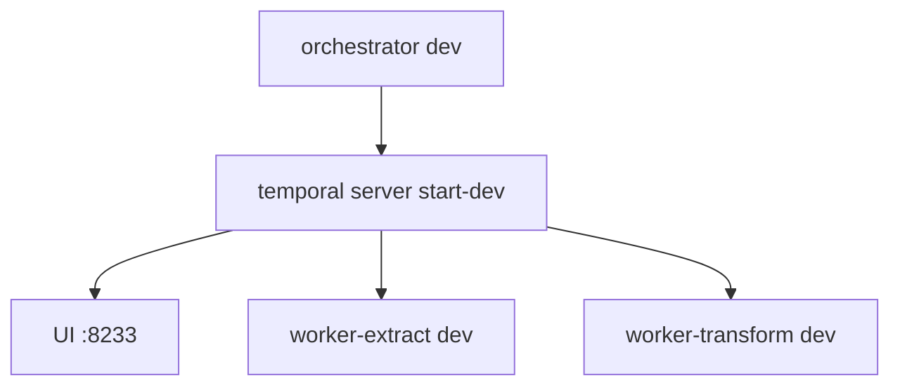

# Local Development

Running the Temporal-based pipeline locally requires a Temporal server, workers,
and proper environment configuration.

## Prerequisites

The Nix dev shell (`nix develop`) provides all required tooling: Node.js 24,
pnpm 9.12.2, Temporal CLI, Biome, git, and jq. Alternatively, install these
manually.

## Environment Variables

Workers require database credentials and (for extract) GitHub App credentials.
Copy `.env.example` to `.env` and fill in values.

**Extract worker requires:**
- `TENANT_DATABASE_AUTH_TOKEN` - auth token for tenant DBs
- `SUPER_DATABASE_URL` - super database connection URL
- `SUPER_DATABASE_AUTH_TOKEN` - super database auth token
- `GITHUB_APP_ID` - GitHub App ID
- `GITHUB_APP_PRIVATE_KEY` - GitHub App private key (multiline PEM)

**Transform worker requires:**
- `TENANT_DATABASE_AUTH_TOKEN`
- `SUPER_DATABASE_URL`
- `SUPER_DATABASE_AUTH_TOKEN`

**Orchestrator uses:**
- `PORT` (default 3000)
- `EXTRACT_SCHEDULE_ENABLED` (default true)
- `TRANSFORM_SCHEDULE_ENABLED` (default true)

All apps default to `TEMPORAL_ADDRESS=localhost:7233` and
`TEMPORAL_NAMESPACE=default`.

## Startup Sequence

```bash
# 1. Start Temporal server
temporal server start-dev

# 2. In separate terminals, start workers
pnpm --filter @dxta/worker-extract dev
pnpm --filter @dxta/worker-transform dev

# 3. Start orchestrator (creates schedules)
pnpm --filter @dxta/orchestrator dev
```

## Manual Workflow Triggers

```bash
pnpm --filter @dxta/orchestrator start:extract
pnpm --filter @dxta/orchestrator start:transform
```

## Temporal UI

Open http://localhost:8233 to view workflows, schedules, and activity history.

## Invariants
- Temporal server must be running before workers start.
- Workers poll their respective task queues (`extract` or `transform`).
- Orchestrator creates schedules on startup if enabled.

## Contracts
- `.env.example` documents all environment variables.
- `README.md` provides user-facing setup instructions.

## Rationale
- Local dev mirrors production: same workers, same Temporal, same env vars.

## Lessons
- Start Temporal first, then workers, then orchestrator.
- Use `temporal server start-dev` for quick local setup with UI.

## Diagram


## Related
- [Monorepo commands](monorepo-commands.md)
- [Orchestrator](../temporal/orchestrator.md)
- [Extract worker](../temporal/extract-worker.md)
- [Transform worker](../temporal/transform-worker.md)
