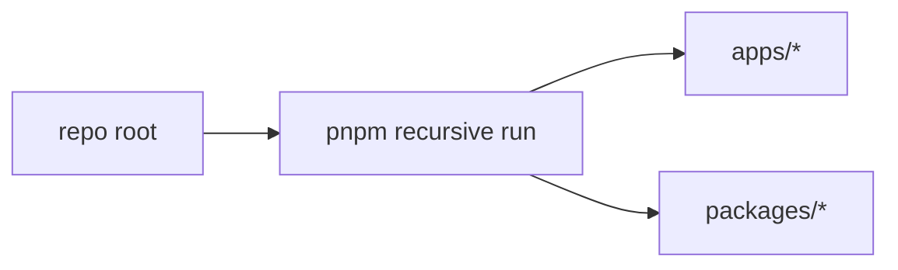

# Monorepo Commands

This repo runs workspace tasks with pnpm recursive commands from the root. Turbo
is not used; task orchestration relies on pnpm filters and `--if-present` to
avoid failures for workspaces that do not define a given script.

## Invariants
- Workspace commands run via pnpm at the repo root.
- Root scripts use `--if-present` to avoid failing on missing scripts.

## Contracts
- Use `pnpm -r --if-present run <script>` for repo-wide tasks.
- Use `pnpm --filter <path-or-name> <script>` for a single app/package.

## Rationale
- Keeping tooling minimal reduces friction in a small monorepo.

## Lessons
- Recursive pnpm runs keep behavior predictable without Turbo caching.

## Code Example
```ts
// package.json (root)
{
  "scripts": {
    "build": "pnpm -r --if-present run build",
    "dev": "pnpm -r --if-present --parallel run dev",
    "test": "pnpm -r --if-present run test"
  }
}
```

## Diagram


## Related
- [Summary](../summary.md)
- [Practices](../practices.md)
