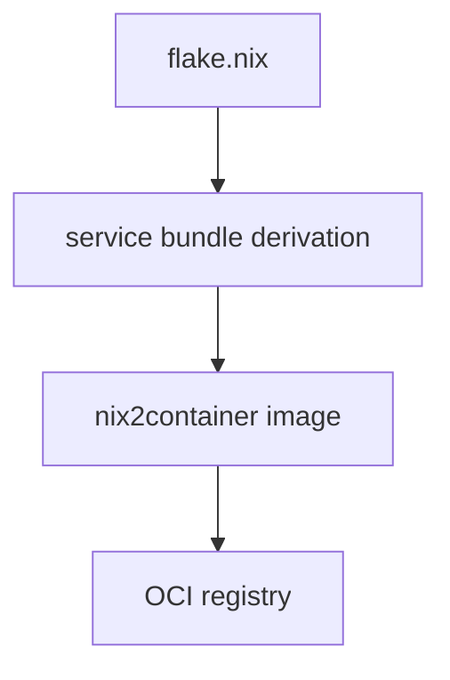

# Nix OCI Images

Deployment images are built with Nix using nix2container. Each service bundles
its compiled workspace output and node_modules into an OCI image without Docker
daemon usage.

## Invariants
- Images are built from Nix derivations using nix2container.
- Each service image runs `node apps/<service>/dist/index.js` from `/app`.
- App bundles include `apps/`, `packages/`, and root `node_modules`.

## Contracts
- `flake.nix` exposes `image-orchestrator`, `image-worker-extract`, and
  `image-worker-transform` packages.
- `pnpmDeps.hash` must be populated for reproducible builds.

## Rationale
- Nix builds OCI images without Docker or BuildKit and keeps builds reproducible.

## Lessons
- All workspace dependencies must be explicit in each package's `package.json`;
  pnpm's isolated install mode does not hoist undeclared deps.

## Code Example
```nix
image-orchestrator = mkImage {
  name = "ghcr.io/dxta-dev/dxta-orchestrator";
  bundle = orchestratorBundle;
  cmd = [ "node" "apps/orchestrator/dist/index.js" ];
  exposedPorts = { "3000/tcp" = { }; };
};
```

## Diagram


## CI/CD

GitHub Actions workflow `.github/workflows/oci-images.yml` builds and pushes
images on merge to `main`. It uses `nix shell nixpkgs#skopeo` to push images
to GHCR tagged with both the commit SHA and `latest`.

## Related
- [Summary](../summary.md)
- [Monorepo commands](monorepo-commands.md)
