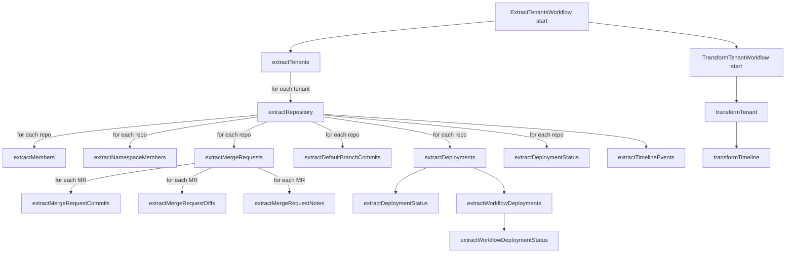

# Temporal Migration Plan (Railway, No AWS)

Date: Tue Jan 20 2026
Repo: /home/davidabram/repos/dxta/pipeline

## Goals

- Replace SST/AWS infra with Temporal on Railway.
- Keep Drizzle and existing integrations.
- Provide manual and scheduled (Temporal Schedule) execution.
- Document workflow and activity boundaries clearly.

## Current SST Topology (Source of Truth)

Files:

- apps/stack/stacks/ExtractStack.ts
- apps/stack/stacks/TransformStack.ts
- apps/stack/sst.config.ts

Key SST resources in use:

- EventBus rules (extract/transform event routing)
- SQS queues with DLQs (ExtractQueue/TransformQueue)
- API Gateway routes for manual starts
- Cron schedules for periodic runs
- SST Config secrets/parameters for env

## Target Temporal Architecture

### Hosting

- Temporal server: Railway (already set up)
- Workers: Railway services (containerized)
- Scheduling: Temporal Schedules (automatic)
- Execution: Manual start via Temporal client or schedule

### Placement Rules

- All Temporal code should live under apps/ (not packages/).
- Each workflow group gets its own worker app and can be deployed independently.

### New Apps (Workspaces)

- apps/temporal-workflows
  - Contains workflow definitions only (deterministic code)
- apps/temporal-worker-extract
  - Extract workflow worker, deployable separately
- apps/temporal-worker-transform
  - Transform workflow worker, deployable separately
- apps/temporal-client
  - Start workflows, create schedules, manual triggers

### Keep As-Is

- packages/schemas/\* (Drizzle schemas and configs)
- packages/integrations/\* (source control integrations)
- packages/functions/\* (activity logic or shared modules)

## Workflow Definitions

### Workflow: ExtractTenantsWorkflow

Purpose:

- Primary extract entry point (manual and scheduled).
- Orchestrates extract fanout by tenant, repository, and merge request.

Inputs:

- tenantId? (optional for all tenants)
- sourceControl? (github/gitlab)
- runMode (full | incremental)

Activities:

- extractTenants
  - Source: apps/stack/src/extract/extract-tenants.\*
- extractRepository
  - Source: apps/stack/src/extract/extract-repository.ts
- extractMembers
  - Source: apps/stack/src/extract/extract-members.eventHandler
- extractNamespaceMembers
  - Source: apps/stack/src/extract/extract-namespace-members.eventHandler
- extractMemberInfo
  - Source: apps/stack/src/extract/extract-member-info.eventHandler
- extractMergeRequests
  - Source: apps/stack/src/extract/extract-merge-requests.eventHandler
- extractMergeRequestCommits
  - Source: apps/stack/src/extract/extract-merge-request-commits.eventHandler
- extractMergeRequestDiffs
  - Source: apps/stack/src/extract/extract-merge-request-diffs.eventHandler
- extractMergeRequestNotes
  - Source: apps/stack/src/extract/extract-merge-request-notes.eventHandler
- extractDefaultBranchCommits
  - Source: apps/stack/src/extract/extract-default-branch-commits.eventHandler
- extractDeployments
  - Source: apps/stack/src/extract/extract-deployments.eventHandler
- extractDeploymentStatus
  - Source: apps/stack/src/extract/extract-deployment-status.\*
- extractWorkflowDeployments
  - Source: apps/stack/src/extract/extract-workflow-deployments.eventHandler
- extractWorkflowDeploymentStatus
  - Source: apps/stack/src/extract/extract-workflow-deployment-status.eventHandler
- extractTimelineEvents
  - Source: apps/stack/src/extract/extract-timeline-events.eventHandler

Notes:

- Replace SQS + EventBus fanout with workflow/child workflow fanout.
- Apply activity retry + timeout policies to replace DLQ behavior.

### Workflow: ExtractInitialDeploymentsWorkflow

Purpose:

- Special entry point for initial deployment extraction.

Inputs:

- tenantId
- sourceControl? (github/gitlab)

Activities:

- extractInitialDeployments
  - Source: apps/stack/src/extract/extract-initial-deployments.apiHandler
- extractDeployments
  - Source: apps/stack/src/extract/extract-deployments.eventHandler
- extractDeploymentStatus
  - Source: apps/stack/src/extract/extract-deployment-status.\*
- extractWorkflowDeployments
  - Source: apps/stack/src/extract/extract-workflow-deployments.eventHandler
- extractWorkflowDeploymentStatus
  - Source: apps/stack/src/extract/extract-workflow-deployment-status.eventHandler

### Workflow: TransformTenantWorkflow

Purpose:

- Transform data after extract runs.

Inputs:

- tenantId
- fromTimestamp?
- toTimestamp?

Activities:

- transformTenant
  - Source: apps/stack/src/transform/transform-tenant.\*
- transformTimeline
  - Source: apps/stack/src/transform/transform-timeline.eventHandler
  - Likely uses packages/functions/transform/\*

## Code Examples

### Workflow + Activity

```ts
// apps/temporal-workflows/src/extract-tenants-workflow.ts
import { proxyActivities } from "@temporalio/workflow";

import type { ExtractActivities } from "../types/activities";
import type { ExtractTenantsInput } from "../types/inputs";

const {
  extractTenants,
  extractRepository,
  extractMembers,
  extractMergeRequests,
  extractMergeRequestCommits,
  extractMergeRequestDiffs,
  extractMergeRequestNotes,
  extractDeployments,
  extractDeploymentStatus,
  extractWorkflowDeployments,
  extractWorkflowDeploymentStatus,
  extractTimelineEvents,
} = proxyActivities<ExtractActivities>({
  startToCloseTimeout: "10 minutes",
  retry: {
    initialInterval: "5 seconds",
    maximumInterval: "5 minutes",
    maximumAttempts: 10,
  },
});

export async function extractTenantsWorkflow(input: ExtractTenantsInput) {
  const tenants = await extractTenants(input);

  for (const tenant of tenants) {
    const repositories = await extractRepository({ tenantId: tenant.id });

    for (const repo of repositories) {
      await extractMembers({ tenantId: tenant.id, repoId: repo.id });

      const mergeRequests = await extractMergeRequests({
        tenantId: tenant.id,
        repoId: repo.id,
      });

      for (const mr of mergeRequests) {
        await extractMergeRequestCommits({ tenantId: tenant.id, mrId: mr.id });
        await extractMergeRequestDiffs({ tenantId: tenant.id, mrId: mr.id });
        await extractMergeRequestNotes({ tenantId: tenant.id, mrId: mr.id });
      }

      await extractDeployments({ tenantId: tenant.id, repoId: repo.id });
      await extractDeploymentStatus({ tenantId: tenant.id, repoId: repo.id });
      await extractWorkflowDeployments({
        tenantId: tenant.id,
        repoId: repo.id,
      });
      await extractWorkflowDeploymentStatus({
        tenantId: tenant.id,
        repoId: repo.id,
      });
      await extractTimelineEvents({ tenantId: tenant.id, repoId: repo.id });
    }
  }
}
```

```ts
// apps/temporal-worker-extract/src/activities/extract.ts
import type { ExtractActivities } from "@dxta/temporal-workflows";
import { extractMembers as extractMembersHandler } from "@dxta/functions/extract";

import type { ExtractActivities } from "@dxta/workflows";

export const extractActivities: ExtractActivities = {
  extractMembers: async (input) => extractMembersHandler(input),
  // other activities wired similarly
};
```

### Worker Bootstrap

```ts
// apps/temporal-worker-extract/src/worker.ts
import { NativeConnection, Worker } from "@temporalio/worker";

import { extractTenantsWorkflow } from "@dxta/temporal-workflows";

import { extractActivities } from "./activities/extract";

async function runWorker() {
  const connection = await NativeConnection.connect({
    address: process.env.TEMPORAL_ADDRESS,
  });

  const worker = await Worker.create({
    connection,
    namespace: process.env.TEMPORAL_NAMESPACE,
    taskQueue: "pipeline",
    workflowsPath: require.resolve("@dxta/workflows"),
    activities: extractActivities,
  });

  await worker.run();
}

void runWorker();
```

### Schedule Creation (Automatic)

```ts
// apps/temporal-client/src/schedules/create-schedules.ts
import { Client } from "@temporalio/client";

async function createSchedules() {
  const client = new Client({
    namespace: process.env.TEMPORAL_NAMESPACE,
    address: process.env.TEMPORAL_ADDRESS,
  });

  await client.schedule.create({
    scheduleId: "extract-tenants-every-15m",
    spec: {
      calendars: [
        {
          second: "0",
          minute: "8/15",
          hour: "*",
          dayOfMonth: "*",
          month: "*",
          year: "*",
          dayOfWeek: "*",
        },
      ],
    },
    action: {
      type: "startWorkflow",
      workflowType: "extractTenantsWorkflow",
      taskQueue: "pipeline",
      args: [{ runMode: "incremental" }],
    },
  });

  await client.schedule.create({
    scheduleId: "transform-tenant-every-15m",
    spec: {
      calendars: [
        {
          second: "0",
          minute: "0/15",
          hour: "*",
          dayOfMonth: "*",
          month: "*",
          year: "*",
          dayOfWeek: "*",
        },
      ],
    },
    action: {
      type: "startWorkflow",
      workflowType: "transformTenantWorkflow",
      taskQueue: "pipeline",
      args: [{ runMode: "incremental" }],
    },
  });
}

void createSchedules();
```

## Fanout Diagram (Mermaid)



## Schedules (Temporal)

- Extract schedule:
  - Equivalent to AWS cron(8/15 \* \* _ ? _)
  - Temporal schedule every 15 minutes, offset at minute 8
- Transform schedule:
  - Equivalent to AWS cron(0/15 \* \* _ ? _)
  - Temporal schedule every 15 minutes, offset at minute 0

## Config and Env Migration (Railway)

From SST Config in apps/stack/stacks/ExtractStack.ts and TransformStack.ts:

- CLERK_JWT_ISSUER
- CLERK_JWT_AUDIENCE
- TENANT_DATABASE_AUTH_TOKEN
- SUPER_DATABASE_URL
- SUPER_DATABASE_AUTH_TOKEN
- CLERK_SECRET_KEY
- REDIS_URL
- REDIS_TOKEN
- REDIS_USER_TOKEN_TTL
- PER_PAGE
- FETCH_TIMELINE_EVENTS_PER_PAGE
- CRON_USER_ID

Plan:

- Move all to Railway env vars.
- Create a shared config module to validate and load env for activities.

## Implementation Phases

1. Baseline design

- Create workflow/activity interfaces and typing definitions.
- Implement workflow-only package structure.

2. Extract migration

- Convert extract handlers into activities.
- Implement ExtractTenantsWorkflow + ExtractInitialDeploymentsWorkflow.
- Validate activity retry and concurrency behavior.

3. Transform migration

- Convert transform handlers into activities.
- Implement TransformTenantWorkflow.

4. Scheduling and manual start

- Implement Temporal schedules with automatic creation.
- Provide a client entrypoint for manual runs.

5. Remove SST/AWS infra

- Remove stacks and sst.config.ts.
- Remove any AWS-specific SDK usage tied to infra.

6. Production rollout

- Deploy worker to Railway.
- Verify schedules and manual triggers.
- Monitor Temporal visibility and activity errors.

## Notes

- Workflows must remain deterministic; all I/O stays in activities.
- Drizzle usage stays in activities; no change to schema packages.
- Integrations remain unchanged; used by activity implementations.
